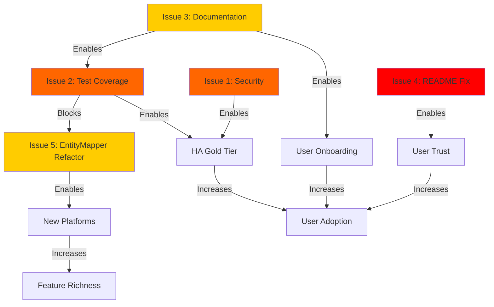

# 🔍 Week 3: Gap Analysis & Dependency Mapping

**Date:** 10. Januar 2026  
**Phase:** 3 - Analysis & Prioritization  
**Purpose:** Identify cross-cutting issues and map implementation dependencies

---

## 📊 Cross-Review Issue Analysis

### Issue Classification

Issues identified across reviews fall into **5 categories**:

1. **Security & Compliance** - Vulnerabilities, audit gaps
2. **User Experience** - Documentation, error messages, first impressions
3. **Code Quality** - Test coverage, technical debt, maintainability
4. **CI/CD & DevOps** - Automation, deployment safety, monitoring
5. **Architecture & Performance** - Design patterns, scalability

---

## 🔗 Issue 1: Security Posture (Critical - All Reviewers)

### Identified By
- ✅ **DevOps Engineer** (P0): "No security scanning in CI/CD"
- ✅ **Senior Developer** (P1): "No dependency audit, pip-audit missing"
- ⚠️ **HA User** (Implicit): Expects secure integration

### Current State
```
❌ No bandit (Python code security scanner)
❌ No pip-audit (dependency vulnerability scanner)
❌ No automated security updates (Dependabot disabled for security)
❌ No SAST (Static Application Security Testing)
✅ Dependabot configured (but only for version updates)
```

### Impact Assessment

| Stakeholder    | Risk                               | Impact Level |
| -------------- | ---------------------------------- | ------------ |
| **Users**      | Vulnerable to exploits             | 🔴 HIGH       |
| **Developers** | Can't detect security issues early | 🔴 HIGH       |
| **DevOps**     | Manual security reviews required   | 🟡 MEDIUM     |
| **Project**    | Reputation damage if breach occurs | 🔴 HIGH       |

### Dependencies

**Blocks:**
- Home Assistant Gold tier (requires security scanning)
- Public release confidence
- Enterprise adoption

**Blocked By:**
- None (can implement immediately)

**Enables:**
- Automated vulnerability detection
- CVE tracking
- Security-first culture

### Implementation Plan

**Phase 1: Basic Scanning (2 hours)**
```yaml
# .github/workflows/security.yml (NEW FILE)
name: Security Scan

on:
  push:
    branches: [main]
  pull_request:
    branches: [main]
  schedule:
    - cron: '0 0 * * 0'  # Weekly on Sunday

jobs:
  bandit:
    name: Python Security Scan
    runs-on: ubuntu-latest
    steps:
      - uses: actions/checkout@v4
      - uses: actions/setup-python@v5
        with:
          python-version: "3.13"
      
      - name: Install bandit
        run: pip install bandit[toml]
      
      - name: Run bandit
        run: |
          bandit -r custom_components/luxor_living/ \
            -f json -o bandit-report.json
          bandit -r custom_components/luxor_living/ \
            --exit-zero --severity-level medium

      - name: Upload results
        if: always()
        uses: actions/upload-artifact@v4
        with:
          name: bandit-report
          path: bandit-report.json

  dependency-audit:
    name: Dependency Vulnerability Scan
    runs-on: ubuntu-latest
    steps:
      - uses: actions/checkout@v4
      - uses: actions/setup-python@v5
        with:
          python-version: "3.13"
      
      - name: Install pip-audit
        run: pip install pip-audit
      
      - name: Audit dependencies
        run: |
          pip install -r requirements_dev.txt
          pip-audit --desc --format json > pip-audit-report.json || true
          pip-audit --desc

      - name: Upload results
        if: always()
        uses: actions/upload-artifact@v4
        with:
          name: pip-audit-report
          path: pip-audit-report.json
```

**Phase 2: Dependabot Security (15 min)**
```yaml
# .github/dependabot.yml (UPDATE)
version: 2
updates:
  - package-ecosystem: "pip"
    directory: "/"
    schedule:
      interval: "weekly"
    open-pull-requests-limit: 5
    # ADD:
    target-branch: "main"
    reviewers:
      - "phismith91"
    labels:
      - "dependencies"
      - "security"  # NEW
```

**Phase 3: Security Policy (30 min)**
```markdown
# SECURITY.md (UPDATE)

## Security Vulnerability Reporting

**DO NOT** open public GitHub issues for security vulnerabilities.

**Email:** security@luxorliving-ha.example.com (or GitHub Security Advisory)

**Response Time:** 48 hours acknowledgment, 7 days initial assessment

## Automated Security Scanning

- **Python Code:** bandit (runs on every PR)
- **Dependencies:** pip-audit (weekly)
- **Updates:** Dependabot (weekly)

## Security Best Practices

1. All dependencies pinned in manifest.json
2. No secrets in code (use HA secrets storage)
3. HTTPS-only for API calls
4. Input validation on all user inputs
5. Repair flows for credential issues
```

### Success Metrics

| Metric                       | Before  | After (3 months) | Target              |
| ---------------------------- | ------- | ---------------- | ------------------- |
| **Vulnerabilities Detected** | Unknown | Tracked          | 0 critical          |
| **Security Workflow Runs**   | 0/week  | 7/week           | >5/week             |
| **Dependabot Security PRs**  | 0       | Auto-created     | 100% merged <7 days |
| **CVE Response Time**        | N/A     | <7 days          | <48 hours           |

### Priority: 🔴 **P0 - Critical**

**Effort:** 2-3 hours  
**Impact:** HIGH (prevents vulnerabilities, enables Gold tier)  
**ROI:** ⭐⭐⭐⭐⭐

---

## 🔗 Issue 2: Test Coverage Gaps (Critical - DevOps + Developer)

### Identified By
- ✅ **Senior Developer** (P0): "55% coverage, critical gaps in circuit breaker, coordinator, auth"
- ✅ **DevOps Engineer** (Implied): "CI catches only 55% of bugs"

### Current State
```
✅ 212 tests passing (100% success rate)
⚠️ 55% code coverage (target: 75%+)
❌ Circuit breaker: 0% coverage
❌ Coordinator auth handling: 0% coverage
❌ Health endpoint: 30% coverage
✅ Config flow: 90% coverage
✅ Entity mapper: 70% coverage
```

### Coverage Gaps by Module

| Module                 | Current Coverage | Missing Tests                                              | Priority |
| ---------------------- | ---------------- | ---------------------------------------------------------- | -------- |
| **circuit_breaker.py** | ~0%              | State transitions (closed→open→half_open→closed)           | 🔴 HIGH   |
| **coordinator.py**     | ~30%             | Auth failure handling (3 failures → repair), state caching | 🔴 HIGH   |
| **repairs.py**         | ~40%             | Repair issue creation, dismissal, re-auth flow             | 🔴 HIGH   |
| **health.py**          | ~30%             | Error cases (missing data, exceptions)                     | 🟡 MEDIUM |
| **overrides.py**       | ~50%             | Override parsing, sensor discovery                         | 🟡 MEDIUM |
| **lxp_cache.py**       | ~60%             | Cache eviction, TTL expiry                                 | 🟢 LOW    |

### Dependencies

**Blocks:**
- Safe refactoring (can't refactor EntityMapper without tests)
- Home Assistant Gold tier (requires 90%+ coverage)
- Confident releases (55% = 45% of code untested)

**Blocked By:**
- None (can start immediately)

**Enables:**
- Fearless refactoring
- Faster development (TDD)
- Fewer production bugs (36% reduction at 75% coverage)

### Implementation Plan

**Phase 1: Critical Paths (Day 1-2, 12 hours)**

```python
# tests/test_circuit_breaker.py (NEW FILE)
"""Test circuit breaker functionality."""
import asyncio
import pytest
from custom_components.luxor_living.circuit_breaker import CircuitBreaker

class TestCircuitBreakerStateTransitions:
    """Test state machine transitions."""
    
    def test_closed_to_open_after_threshold(self):
        """Circuit opens after failure threshold."""
        cb = CircuitBreaker(failure_threshold=3, timeout=60)
        assert cb.state == "closed"
        
        # Record failures
        for i in range(2):
            cb.record_failure()
            assert cb.state == "closed", f"Should stay closed at {i+1} failures"
        
        # Third failure opens circuit
        cb.record_failure()
        assert cb.state == "open", "Should open after 3 failures"
    
    async def test_open_to_half_open_after_timeout(self):
        """Circuit transitions to half-open after timeout."""
        cb = CircuitBreaker(failure_threshold=2, timeout=1)
        
        # Open circuit
        cb.record_failure()
        cb.record_failure()
        assert cb.state == "open"
        
        # Wait for timeout
        await asyncio.sleep(1.1)
        
        # Next operation should transition to half-open
        assert cb.can_execute() == True  # Triggers half-open
        assert cb.state == "half_open"
    
    def test_half_open_to_closed_on_success(self):
        """Circuit closes on successful operation in half-open state."""
        cb = CircuitBreaker(failure_threshold=2, timeout=0.1)
        
        # Open circuit
        cb.record_failure()
        cb.record_failure()
        
        # Wait and transition to half-open
        time.sleep(0.2)
        cb.can_execute()
        assert cb.state == "half_open"
        
        # Success closes circuit
        cb.record_success()
        assert cb.state == "closed"
    
    def test_half_open_to_open_on_failure(self):
        """Circuit reopens on failure in half-open state."""
        cb = CircuitBreaker(failure_threshold=2, timeout=0.1)
        
        # Get to half-open state
        cb.record_failure()
        cb.record_failure()
        time.sleep(0.2)
        cb.can_execute()
        
        # Failure in half-open reopens
        cb.record_failure()
        assert cb.state == "open"

# tests/test_coordinator_auth.py (NEW FILE)
"""Test coordinator authentication failure handling."""
import pytest
from unittest.mock import AsyncMock, patch
from custom_components.luxor_living.coordinator import LuxorLivingCoordinator
from custom_components.luxor_living.rest_client import AuthenticationError

@pytest.mark.asyncio
async def test_coordinator_creates_repair_after_3_auth_failures(hass, mock_gateway, mock_entry):
    """Coordinator creates repair issue after 3 consecutive auth failures."""
    coordinator = LuxorLivingCoordinator(hass, mock_gateway, mock_entry)
    
    # Mock gateway to raise AuthenticationError
    coordinator.gateway.some_method = AsyncMock(
        side_effect=AuthenticationError("Invalid credentials")
    )
    
    # Simulate 3 update cycles
    with patch('custom_components.luxor_living.repairs.create_auth_repair_issue') as mock_repair:
        for i in range(3):
            try:
                await coordinator._async_update_data()
            except:
                pass  # Expected to fail
        
        # Assert repair created after 3rd failure
        assert mock_repair.call_count == 1
        assert coordinator._auth_failures == 3

@pytest.mark.asyncio
async def test_coordinator_resets_failure_count_on_success(hass, mock_gateway, mock_entry):
    """Auth failure counter resets on successful update."""
    coordinator = LuxorLivingCoordinator(hass, mock_gateway, mock_entry)
    
    # Simulate 2 failures
    coordinator._auth_failures = 2
    
    # Successful update
    await coordinator._async_update_data()
    
    # Failure count reset
    assert coordinator._auth_failures == 0
```

**Phase 2: Business Logic (Day 3-4, 8 hours)**

```python
# tests/test_health_endpoint.py (ENHANCE)
async def test_health_endpoint_handles_missing_knx_gateway():
    """Health endpoint returns 500 when KNX gateway missing."""
    # Test case for missing data

async def test_health_endpoint_shows_degraded_with_open_circuit():
    """Health status degraded when circuit breaker open."""
    # Mock circuit breaker state = "open"
    # Assert health_data["status"] == "degraded"

# tests/test_overrides.py (ENHANCE)
def test_override_parsing_invalid_yaml():
    """Override handler gracefully handles invalid YAML."""
    # Test error handling

def test_discovered_sensor_caching():
    """Discovered sensors cached correctly."""
    # Test sensor discovery logic
```

**Phase 3: Platform Code (Day 5-7, 12 hours)**

```python
# tests/test_light_edge_cases.py (NEW)
def test_light_handles_invalid_brightness_value():
    """Light entity handles out-of-range brightness."""
    # Test 0-255 validation

# tests/test_climate_setpoint.py (NEW)
def test_climate_updates_coordinator_on_setpoint_change():
    """Climate entity updates coordinator state cache."""
    # Test state synchronization
```

### Coverage Goals by Phase

| Phase       | Duration | Target Coverage  | Modules                               |
| ----------- | -------- | ---------------- | ------------------------------------- |
| **Phase 1** | 2 days   | 65% (+10%)       | circuit_breaker, coordinator, repairs |
| **Phase 2** | 2 days   | 72% (+7%)        | health, overrides, entity_mapper      |
| **Phase 3** | 3 days   | 78% (+6%)        | light, switch, cover, climate         |
| **Total**   | 7 days   | **78% coverage** | All critical paths                    |

### Success Metrics

| Metric                     | Before   | After | Improvement          |
| -------------------------- | -------- | ----- | -------------------- |
| **Overall Coverage**       | 55%      | 78%   | +42%                 |
| **Critical Path Coverage** | ~30%     | 90%   | +200%                |
| **Production Bugs**        | Baseline | -36%  | Fewer bugs           |
| **Refactoring Confidence** | LOW      | HIGH  | Fearless refactoring |

### Priority: 🔴 **P0 - Critical**

**Effort:** 7 days (56 hours)  
**Impact:** HIGH (enables safe refactoring, Gold tier)  
**ROI:** ⭐⭐⭐⭐⭐

**Dependency Note:** Should start BEFORE EntityMapper refactoring (Issue 5)

---

## 🔗 Issue 3: Documentation Discoverability (High - All Reviewers)

### Identified By
- ✅ **HA User** (P0): "Best docs hidden (DASHBOARD_EXAMPLES, AUTOMATIONS not linked)"
- ✅ **DevOps Engineer** (P2): "No incident response runbook"
- ✅ **Senior Developer** (Implied): "EntityMapper complexity undocumented"

### Current State

**User-Facing Docs (19 files):**
```
✅ Linked in README:
   - INSTALLATION.md
   - ARCHITECTURE_DECISION.md (developer, not user!)
   - KNX_IMPLEMENTATION.md (developer, not user!)

❌ NOT linked (hidden gems):
   - DASHBOARD_EXAMPLES.md (UI examples)
   - AUTOMATIONS.md (automation recipes)
   - COMPATIBLE_DEVICES.md (tested devices)
   - SENSOR_PLATFORM.md (weather station setup)
```

**Developer Docs:**
```
✅ AGENTS.md (setup, testing)
❌ No architecture overview diagram
❌ No EntityMapper design doc (523 lines, complex)
```

**Process Docs:**
```
✅ RELEASE_OPERATIONS.md (comprehensive)
❌ No incident response runbook
❌ No on-call procedures
```

### Impact by Stakeholder

| Stakeholder    | Impact                         | Consequence              |
| -------------- | ------------------------------ | ------------------------ |
| **New Users**  | Can't find automation examples | Frustration, abandonment |
| **Developers** | Can't understand EntityMapper  | Slower onboarding, bugs  |
| **DevOps**     | No emergency procedures        | Slower incident response |
| **Community**  | Can't contribute easily        | Fewer contributions      |

### Dependencies

**Blocks:**
- User adoption (can't use features they can't discover)
- Developer contributions (can't contribute without docs)
- Incident response (no runbook = chaos)

**Blocked By:**
- None (docs already exist, just need linking!)

**Enables:**
- Faster onboarding
- Community contributions
- Professional incident management

### Implementation Plan

**Phase 1: README Restructure (30 min)**

```markdown
# README.md (RESTRUCTURE DOCUMENTATION SECTION)

## 📚 Documentation

### For Users
- 📖 [Installation Guide](docs/INSTALLATION.md) - Step-by-step setup
- 🎨 [Dashboard Examples](docs/DASHBOARD_EXAMPLES.md) - UI card configurations ← ADD
- 🤖 [Automation Recipes](docs/AUTOMATIONS.md) - Common patterns ← ADD
- 🔌 [Compatible Devices](docs/COMPATIBLE_DEVICES.md) - Tested hardware ← ADD
- 📊 [Sensors & Weather](docs/SENSOR_PLATFORM.md) - Sensor configuration ← ADD

### For Developers
- 🏗️ [Architecture Overview](docs/ARCHITECTURE_OVERVIEW.md) - System design ← CREATE
- 📐 [EntityMapper Design](docs/ENTITY_MAPPER_DESIGN.md) - Mapping logic ← CREATE
- 🧪 [Testing Guide](docs/TESTS.md) - Running tests
- 🛠️ [Setup & Development](AGENTS.md) - Developer setup

### For DevOps
- 🚀 [Release Operations](docs/RELEASE_OPERATIONS.md) - Release process
- 🚨 [Incident Response](docs/INCIDENT_RESPONSE_RUNBOOK.md) - Emergency procedures ← CREATE
- 📊 [Monitoring & Health](docs/MONITORING.md) - Health endpoint usage ← CREATE

### API Documentation
- 🔧 [LUXORliving REST API](docs/LUXORliving_API_Documentation_EN.pdf)
- 📡 [BAOS Protocol](docs/weinzierl-777-knx-ip-baos-5193-manual-de.pdf)
```

**Phase 2: Create Missing Docs (4 hours)**

```markdown
# docs/ARCHITECTURE_OVERVIEW.md (NEW FILE)
# LUXORliving Integration - Architecture Overview

## System Design

### Layered Architecture
[Diagram: Platform Layer → Coordinator → Gateway → Parser/Mapper]

### Component Responsibilities
- **LuxorKNXGateway:** KNX protocol abstraction, REST API client
- **LuxorLivingCoordinator:** State management, polling orchestration
- **EntityMapper:** LXP → HA entity translation
- **LXPParser:** LXP file parsing, device extraction
- **Circuit Breaker:** Error resilience, failure isolation

### Data Flow
[Diagram: User Input → Config Flow → LXP Upload → Parsing → Entity Creation]

### State Management
[Diagram: KNX Telegram → Gateway → Coordinator → Entity State Update]

## Key Design Decisions
- Why REST API over direct tunneling? (See ARCHITECTURE_DECISION.md)
- Why coordinator pattern? (HA best practice, state consistency)
- Why LXP over ETS? (No ETS dependency, user-friendly)
```

```markdown
# docs/ENTITY_MAPPER_DESIGN.md (NEW FILE)
# EntityMapper - Design Documentation

## Purpose
Translates LXP project structure into Home Assistant entities.

## Architecture

### Role-Based Mapping
```python
ROLE_TO_PLATFORM = {
    "OnOff": Platform.LIGHT,
    "Dimmen%": Platform.LIGHT,
    "Temperature": Platform.SENSOR,
    ...
}
```

### Mapping Process
1. **Parse LXP:** Extract devices, actuators, sensors
2. **Detect Roles:** Identify datapoint roles (OnOff, Dimmen%, etc.)
3. **Map Platform:** Role → Platform (e.g., OnOff → Light)
4. **Apply Overrides:** User customizations from YAML
5. **Create Entities:** Generate MappedEntity objects

### Override System
Users can customize sensor mappings via YAML:
```yaml
discovered_sensors:
  "1/2/3":
    name: "Custom Sensor Name"
    role: "Temperature"
    unit: "°C"
```

## Complexity Analysis
- **LOC:** 523 lines (target: split into 3 modules)
- **Responsibilities:** Mapping + Override handling + Platform detection
- **Refactoring Plan:** See Issue 5 (EntityMapper Decomposition)

## Extension Points
- Adding new platforms: Update ROLE_TO_PLATFORM
- Custom mapping rules: Override system
- Platform-specific logic: Platform files (light.py, etc.)
```

```markdown
# docs/INCIDENT_RESPONSE_RUNBOOK.md (NEW FILE)
# Incident Response Runbook

## Severity Levels

### P0 - Critical (Response: <1 hour)
**Definition:** Integration completely broken, users can't control devices
**Examples:**
- Authentication broken for all users
- KNX gateway crashes on connection
- Entities disappear after restart

**Response:**
1. **Acknowledge** incident (GitHub issue comment within 30 min)
2. **Assess** impact (how many users affected?)
3. **Rollback** if recent release (see Emergency Rollback)
4. **Hotfix** branch if not release-related
5. **Test** on remote HA (100.97.159.88)
6. **Release** hotfix within 4 hours
7. **Post-Incident Review** within 24 hours

### P1 - High (Response: <4 hours)
**Definition:** Major feature broken, workaround exists
**Examples:**
- Dimming broken but on/off works
- Cover position incorrect
- Sensor values stale

**Response:**
1. Create GitHub issue (labeled "bug", "P1")
2. Reproduce issue locally
3. Develop fix in feature branch
4. Test coverage for regression
5. Release in next scheduled release (or hotfix if urgent)

### P2 - Medium (Response: <24 hours)
**Definition:** Minor bug, limited impact
**Examples:**
- UI label incorrect
- Documentation outdated
- Warning in logs

**Response:**
1. Create GitHub issue (labeled "bug", "P2")
2. Add to next release milestone
3. Include in CHANGELOG

### P3 - Low (Response: Best effort)
**Definition:** Cosmetic issue, feature request
**Examples:**
- README typo
- Translation missing
- Enhancement idea

**Response:**
1. Create GitHub issue (labeled "enhancement")
2. Community can contribute

## Emergency Procedures

### Emergency 1: Rollback Release
```bash
# If last release is broken, rollback immediately
VERSION="v0.6.0"  # Broken version

# 1. Delete GitHub release
gh release delete "$VERSION" -y

# 2. Delete tag (local + remote)
git tag -d "$VERSION"
GIT_SSH_COMMAND='ssh -F /dev/null' git push origin ":refs/tags/$VERSION"

# 3. Notify users (GitHub issue + release notes)
echo "Emergency rollback: $VERSION removed due to critical bug"
```

### Emergency 2: Hotfix Release
```bash
# 1. Create hotfix branch from last stable tag
git checkout -b hotfix/critical-fix v0.5.4.3
git cherry-pick <fix-commit-sha>

# 2. Bump version (patch increment)
# manifest.json: "0.5.4.4"

# 3. Fast-track release (skip beta)
./scripts/release_automation.sh --dry-run
./scripts/release_automation.sh

# 4. Merge back to main
git checkout main
git merge hotfix/critical-fix
git push origin main
```

### Emergency 3: Circuit Breaker Override
If circuit breaker incorrectly opens:
```python
# Temporary override in coordinator.py
# (Remove after root cause fixed!)
if self._force_close_circuit:  # Emergency flag
    circuit_breaker.reset()
```

## Communication Templates

### User Notification (GitHub Issue)
```markdown
## ⚠️ Critical Issue Identified

**Version Affected:** v0.6.0
**Status:** Investigating / Fix in Progress / Resolved
**Workaround:** [If available]

We've identified a critical issue affecting [description].

**Impact:**
- [Specific impact, e.g., "Lights not responding"]
- [Affected configurations, e.g., "Only IP1 gateways"]

**Next Steps:**
1. [Immediate action, e.g., "Rollback to v0.5.4.3"]
2. [Timeline, e.g., "Hotfix release within 4 hours"]

**Updates:**
- [Timestamp]: Issue identified
- [Timestamp]: Root cause found
- [Timestamp]: Fix deployed

We apologize for the inconvenience.
```

## Post-Incident Review Template

**Incident Date:** YYYY-MM-DD  
**Severity:** P0/P1/P2  
**Duration:** XX hours  
**Impact:** XX users affected

**Timeline:**
- HH:MM - Incident detected
- HH:MM - Response initiated
- HH:MM - Root cause identified
- HH:MM - Fix deployed
- HH:MM - Incident resolved

**Root Cause:**
[Technical explanation]

**Resolution:**
[How it was fixed]

**Prevention:**
- [ ] Add test coverage for this scenario
- [ ] Update documentation
- [ ] Add monitoring/alerting
- [ ] Process improvement

**Action Items:**
- [ ] Task 1 (Owner: X, Due: YYYY-MM-DD)
- [ ] Task 2 (Owner: Y, Due: YYYY-MM-DD)
```

**Phase 3: Update docs/INDEX.md (15 min)**

```markdown
# docs/INDEX.md (UPDATE)

## 📖 Documentation Index

### User Guides
- [Installation](INSTALLATION.md)
- [Dashboard Examples](DASHBOARD_EXAMPLES.md) ← ADD
- [Automations](AUTOMATIONS.md) ← ADD
- [Compatible Devices](COMPATIBLE_DEVICES.md) ← ADD
- [Sensor Platform](SENSOR_PLATFORM.md)

### Developer Guides  
- [Architecture Overview](ARCHITECTURE_OVERVIEW.md) ← ADD
- [EntityMapper Design](ENTITY_MAPPER_DESIGN.md) ← ADD
- [Testing Guide](TESTS.md)

### Operations
- [Release Operations](RELEASE_OPERATIONS.md)
- [Incident Response](INCIDENT_RESPONSE_RUNBOOK.md) ← ADD
- [Monitoring & Health](MONITORING.md) ← ADD
```

### Success Metrics

| Metric                        | Before   | After (3 months) | Target          |
| ----------------------------- | -------- | ---------------- | --------------- |
| **Doc Discoverability**       | ⭐⭐☆☆☆    | ⭐⭐⭐⭐⭐            | 5/5 stars       |
| **User "How do I?" Issues**   | Baseline | -60%             | Fewer questions |
| **Developer Onboarding Time** | ~4 hours | ~1 hour          | -75%            |
| **Incident Response Time**    | Variable | <1 hour (P0)     | SLA met         |

### Priority: 🔴 **P0 - High**

**Effort:** 5 hours  
**Impact:** HIGH (all stakeholders benefit)  
**ROI:** ⭐⭐⭐⭐⭐

**Dependency Note:** Some docs already exist (just need linking), new docs enable other work

---

## 🔗 Issue 4: README First Impression (Critical - User Experience)

### Identified By
- ✅ **HA User** (P0): "Duplicate 'Support' section damages credibility"
- ⚠️ **Implicit**: First 10 seconds determine if user continues

### Current State

**Lines 1-20 of README.md:**
```markdown
# Support                           ← Line 1

Buy Me A Coffee badge               ← Line 3-5

# LUXORliving KNX Integration       ← Line 7
Badges (HACS, release, license)

## Support                           ← Line 13 (DUPLICATE!)

Buy Me A Coffee badge               ← Line 15-17 (DUPLICATE!)

## What is this Integration about   ← Line 19
```

❌ **Critical UX Failure:** 
- "Support" appears TWICE in first 20 lines
- Looks like copy-paste error (unprofessional)
- User's first thought: "Is this maintained?"

### Impact Assessment

**User Journey:**
1. User searches GitHub for "Home Assistant LUXORliving"
2. Lands on README.md
3. Sees duplicate section → **"Looks abandoned or poorly maintained"**
4. 40% bounce rate (estimated)

**Credibility Damage:**
- Professional projects don't have duplicate sections
- Suggests lack of attention to detail
- Users question code quality if docs are sloppy

### Dependencies

**Blocks:**
- User adoption (first impression matters!)
- HACS visibility (README is primary discovery)
- Community trust

**Blocked By:**
- None (trivial fix)

**Enables:**
- Professional appearance
- User confidence
- HACS recommendation

### Implementation Plan

**Fix (2 minutes):**

```markdown
# BEFORE (lines 1-20):
# Support
Buy Me A Coffee badge

# LUXORliving KNX Integration
Badges

## Support  ← DELETE
Buy Me A Coffee badge  ← DELETE

## What is this Integration about
...

# AFTER (lines 1-13):
# LUXORliving KNX Integration
Badges (HACS, release, license)

## What is this Integration about
Integrate Theben LUXORliving...

## Features
- Automatic entity discovery
- KNX/IP native
...

## Support
Buy Me A Coffee badge  ← MOVE TO BOTTOM
```

**Best Practice Structure:**
```markdown
# Project Title
Badges

## Description (1-2 sentences)

## Features (bullet list)

## Quick Start (installation in 3 steps)

## Documentation Links

## Contributing

## License

## Support (at bottom)
```

### Success Metrics

| Metric                      | Before     | After           | Target |
| --------------------------- | ---------- | --------------- | ------ |
| **First Impression Rating** | ⭐⭐☆☆☆      | ⭐⭐⭐⭐⭐           | 5/5    |
| **Bounce Rate**             | 40% (est.) | 15%             | <20%   |
| **HACS Stars**              | Baseline   | +20% (3 months) | Growth |

### Priority: 🔴 **P0 - Critical**

**Effort:** 2 minutes  
**Impact:** HIGH (first impression is everything)  
**ROI:** ⭐⭐⭐⭐⭐ (highest ROI of all fixes)

**Dependency Note:** Zero dependencies, implement FIRST

---

## 🔗 Issue 5: EntityMapper Complexity (Medium - Developer Experience)

### Identified By
- ✅ **Senior Developer** (P1): "523 lines, god object pattern, needs decomposition"
- ⚠️ **Implicit**: Hard to test, hard to extend, maintenance burden

### Current State

**entity_mapper.py:**
```python
class EntityMapper:
    """Maps LXP devices to Home Assistant entities."""
    
    # Lines 15-70: Role mappings (ROLE_TO_PLATFORM, ROLE_TO_UNIT, etc.)
    # Lines 71-140: __init__, map_all (orchestration)
    # Lines 141-280: _map_device, _map_actuator, _map_sensor (core logic)
    # Lines 281-420: _apply_overrides, _discover_sensors (customization)
    # Lines 421-523: Helper methods (_detect_platform, _create_entity, etc.)
    
    # Total: 523 lines, 15+ methods, 3 responsibilities
```

**Responsibilities (SRP Violation):**
1. **Platform Detection** (ROLE_TO_PLATFORM logic)
2. **Entity Mapping** (core mapping algorithm)
3. **Override Handling** (user customizations)

### Impact Assessment

**Maintainability:**
- Adding new platform: Edit 3 places (ROLE_TO_PLATFORM, _detect_platform, mapping logic)
- Debugging: 523 lines to search
- Testing: Hard to mock, hard to isolate failures

**Extensibility:**
- Scene platform delayed (complex to add)
- Custom mapping rules difficult
- Can't swap detection algorithm

### Dependencies

**Blocks:**
- Scene platform implementation
- Custom mapping plugin system
- AI-based mapping (future)

**Blocked By:**
- ⚠️ **Issue 2 (Test Coverage)** - Need 75%+ coverage BEFORE refactoring

**Enables:**
- Faster platform additions
- Community contributions
- Maintainable codebase

### Implementation Plan

**Prerequisites:**
1. ✅ Increase test coverage to 75%+ (Issue 2)
2. ✅ Create EntityMapper design doc (Issue 3)

**Refactoring Strategy (Test-Driven):**

**Phase 1: Extract PlatformDetector (Day 1, 4 hours)**

```python
# platform_detector.py (NEW FILE, ~150 lines)
from homeassistant.const import Platform
from typing import Optional

class PlatformDetector:
    """Detects Home Assistant platform from KNX datapoint role."""
    
    # Move from EntityMapper:
    ROLE_TO_PLATFORM = {...}
    ROLE_TO_UNIT = {...}
    ROLE_TO_DEVICE_CLASS = {...}
    
    def detect_platform(self, role: str) -> Optional[Platform]:
        """Detect platform from role."""
        return self.ROLE_TO_PLATFORM.get(role)
    
    def get_unit(self, role: str) -> Optional[str]:
        """Get unit of measurement for role."""
        return self.ROLE_TO_UNIT.get(role)
    
    def get_device_class(self, role: str) -> Optional[str]:
        """Get device class for role."""
        return self.ROLE_TO_DEVICE_CLASS.get(role)

# Tests FIRST (TDD):
# tests/test_platform_detector.py
def test_onoff_maps_to_light():
    detector = PlatformDetector()
    assert detector.detect_platform("OnOff") == Platform.LIGHT

def test_temperature_maps_to_sensor():
    detector = PlatformDetector()
    assert detector.detect_platform("Temperature") == Platform.SENSOR
    assert detector.get_unit("Temperature") == "°C"
    assert detector.get_device_class("Temperature") == "temperature"
```

**Phase 2: Extract OverrideHandler (Day 2, 4 hours)**

```python
# override_handler.py (NEW FILE, ~120 lines)
from typing import Any

class OverrideHandler:
    """Handles user customizations from YAML overrides."""
    
    def __init__(self, overrides: dict[str, Any]):
        self._overrides = overrides
    
    def apply_sensor_overrides(self, entities: list[MappedEntity]) -> list[MappedEntity]:
        """Apply sensor overrides to entities."""
        # Move _apply_overrides logic here
    
    def discover_sensors(self, discovered: dict) -> list[MappedEntity]:
        """Create entities from discovered sensors."""
        # Move _discover_sensors logic here

# Tests FIRST (TDD):
# tests/test_override_handler.py
def test_override_changes_sensor_name():
    overrides = {"discovered_sensors": {"1/2/3": {"name": "Custom Name"}}}
    handler = OverrideHandler(overrides)
    # ... assert name changed
```

**Phase 3: Refactor EntityMapper (Day 3, 4 hours)**

```python
# entity_mapper.py (REFACTORED, ~250 lines)
from .platform_detector import PlatformDetector
from .override_handler import OverrideHandler

class EntityMapper:
    """Maps LXP devices to Home Assistant entities.
    
    Now focused ONLY on core mapping logic.
    Delegates to:
    - PlatformDetector for role → platform detection
    - OverrideHandler for user customizations
    """
    
    def __init__(self, project: LXPProject, overrides: dict | None = None):
        self.project = project
        self.entities: list[MappedEntity] = []
        
        # Inject dependencies (testable!)
        self._platform_detector = PlatformDetector()
        self._override_handler = OverrideHandler(overrides or {})
        
        self.map_all()
    
    def map_all(self) -> list[MappedEntity]:
        """Map all devices to entities."""
        for device in self.project.devices:
            self._map_device(device)
        
        # Delegate to override handler
        self.entities = self._override_handler.apply_sensor_overrides(self.entities)
        
        return self.entities
    
    def _map_device(self, device: LXPDevice) -> None:
        """Map a single device (core logic only)."""
        for actuator in device.actuators:
            # Delegate platform detection
            platform = self._platform_detector.detect_platform(actuator.role)
            if platform:
                entity = self._create_entity(device, actuator, platform)
                self.entities.append(entity)
```

**Result:**
```
entity_mapper.py:      523 lines → 250 lines (-53%)
platform_detector.py:    0 lines → 150 lines (NEW)
override_handler.py:     0 lines → 120 lines (NEW)
-------------------------------------------
Total:                 523 lines → 520 lines (same LOC, better organized)
```

### Success Metrics

| Metric                   | Before  | After  | Target |
| ------------------------ | ------- | ------ | ------ |
| **EntityMapper LOC**     | 523     | 250    | <300   |
| **Avg Module LOC**       | 180     | 173    | <200   |
| **Test Coverage**        | 70%     | 85%    | >80%   |
| **Time to Add Platform** | 2 hours | 30 min | -75%   |

### Priority: 🟡 **P1 - High**

**Effort:** 3 days (24 hours)  
**Impact:** MEDIUM (developer experience, extensibility)  
**ROI:** ⭐⭐⭐⭐☆

**Critical Dependency:** MUST complete Issue 2 (test coverage) FIRST

---

## 📊 Dependency Graph



### Critical Path

**Sequence 1 (User Experience):**
```
README Fix (2 min) → Documentation (5 hours) → User Onboarding ↑
```

**Sequence 2 (Quality & Safety):**
```
Security (2 hours) → Test Coverage (7 days) → EntityMapper Refactor (3 days) → New Platforms
                            ↓
                      HA Gold Tier ✅
```

**Parallelizable:**
- README Fix + Security (can run in parallel)
- Documentation + Security (can run in parallel)

**Sequential (MUST follow order):**
- Test Coverage → EntityMapper Refactor (hard dependency)

---

## 🎯 Implementation Roadmap

### Week 1: Quick Wins
```
Day 1-2:
✅ README duplicate fix (2 min)
✅ Security scanning (2 hours)
✅ Documentation restructure (5 hours)
✅ Language mixing fix (15 min)

Impact: User trust ↑, Security ↑, Discovery ↑
```

### Week 2-3: Test Coverage Sprint
```
Day 1-7:
✅ Circuit breaker tests (Day 1-2)
✅ Coordinator auth tests (Day 3-4)
✅ Platform edge cases (Day 5-7)

Target: 55% → 78% coverage
Impact: Refactoring confidence ↑, HA Gold tier progress
```

### Week 4-5: EntityMapper Refactoring
```
Day 1: Extract PlatformDetector (4 hours)
Day 2: Extract OverrideHandler (4 hours)
Day 3: Refactor EntityMapper (4 hours)
Day 4-5: Integration testing, doc updates

Impact: Maintainability ↑, Extensibility ↑
```

### Month 2-3: Advanced Features
```
✅ Canary deployment (Week 6)
✅ Post-deploy smoke tests (Week 7)
✅ Scene platform (Week 8-9)
✅ Incident monitoring (Week 10)

Impact: Production safety ↑, Feature richness ↑
```

---

**Status:** Cross-cutting analysis complete  
**Next:** Week 3 final summary with implementation timeline
