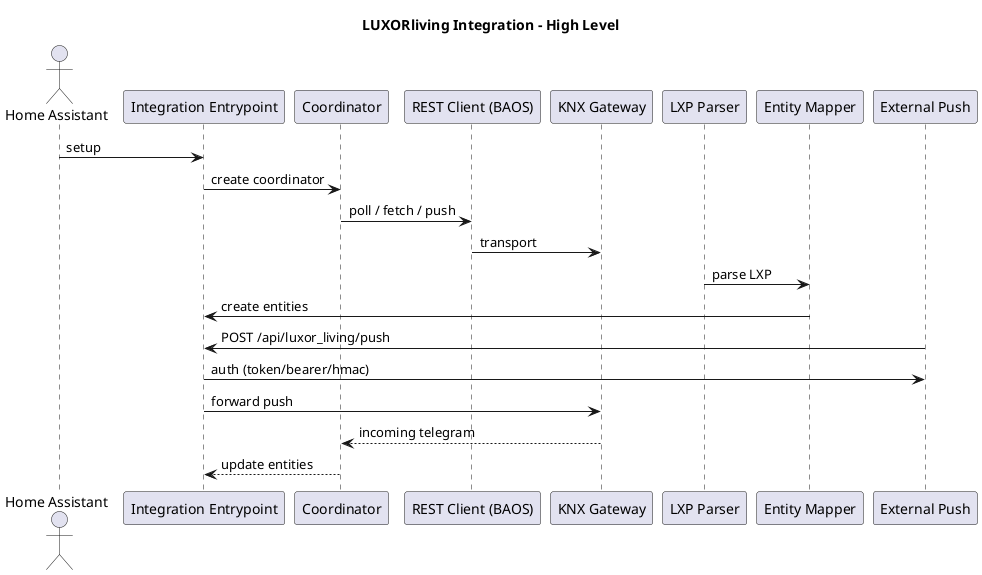

# ARCHITECTURE — LUXORliving Integration

## Kurzüberblick 🎯
Dieses Dokument beschreibt die hoch­ebenige Architektur der LUXORliving Home Assistant Integration, zentrale Komponenten, Datenflüsse, Designentscheidungen und die Schritte, die nötig sind, um Gold‑Compliance zu erreichen.

Ziel: klare Systemgrenzen, Verantwortlichkeiten, Kompatibilitätsmatrix und Entscheidungsdokumentation für Contributor und Reviewer.

---

## Komponentenübersicht 🔧
- `custom_components/luxor_living/__init__.py` — Integration entrypoint, health endpoint, lifecycle
- `rest_client.py` — BAOS / KNX REST API client abstraction
- `knx_gateway.py` — KNX gateway & transport-specific logic (tunneling/routing/simulation)
- `lxp_parser.py` — LXP file parsing & project model
- `entity_mapper.py` — Mapping LXP entities → HA entities
- `coordinator.py`* — Data coordinator patterns (polling/cache)
- Plattformen: `light.py`, `switch.py`, `sensor.py`, `binary_sensor.py`, `cover.py`, `climate.py`
- `scripts/` — Hilfs- und Release‑Skripte (validate, network, deploy, tests)
- `tests/` — Unittests und Integration‑Like tests (pytest)
- `.github/` — CI Workflows, agent docs, release checks

> Siehe auch: `docs/ARCHITECTURE_DECISION.md` für einzelne Design-Entscheidungen.

---

## Datenfluss (vereinfachtes Sequenzdiagramm) 🔁

1) Konfiguration (UI / file) → `async_setup_entry` → `Coordinator` wird angelegt
2) `Coordinator` ruft REST‑Client (BAOS) auf → verarbeitet Telegrame / Polling
3) `LXP Parser` liefert Entities → `Entity Mapper` erstellt HA‑Entitäten
4) KNX‑Events → `knx_gateway` → Coordinator → Entitäten aktualisieren und emit events
5) Push/Webhook → Auth Layer → Push View → Validierung → Vermittlung an `knx_gateway`

PlantUML Übersicht (siehe `docs/architecture.puml`):



---

```text
ASCII Übersicht (backwards-compatible):
[Home Assistant] <-> [Integration Entrypoint]
                      |-- Coordinator -- REST Client --> BAOS/Device
                      |-- LXP Parser --> Entity Mapper --> HA Entities
                      |-- Push View <-- Auth Layer <-- External Push
```

---

## Designentscheidungen (Kurzfassung) 💡
- Version: Keine Hardcodierten Versionen (manifest.json ist Source of Truth). Health endpoint liest `manifest.json` dynamisch.
- Formatting-first: `black` + `isort` enforced in CI & pre-release scripts.
- Release workflow: PR-only → `agent_release_manager` hat Merge‑Berechtigung.
- Tests: Test-Counter in README synchronisiert durch `agent_testing` (automatisiert bei Releases).
- HACS-Readiness: ZIP‑strukturprüfung in Release‑Skript, manifest.json Pflichtfelder überprüft in CI.

Referenzen: `agent_release_manager.md`, `agent_testing.md`, `CONTEXT.md`.

---

## Kompatibilität & Tests ✅
- Zielmatrix für Gold:
  - Home Assistant: 2025.12.x, 2026.1.x, latest
  - Python: 3.11, 3.13
- CI: Matrix‑Job in GitHub Actions, Teilaufgaben:
  - Lint (black/isort) ✅
  - Unit tests (pytest) ✅
  - Integration‑like tests (LXP parsing, mapping) ✅
  - HACS validation / ZIP build ✅

Akzeptanzkriterium: grüne Matrix für die oben genannten Versionen.

---

## Sicherheit & Datenschutz 🔒
- Diagnostics: sensitive values must be redacted (`**REDACTED**`). Unit tests should assert redaction.
- Auth: Push endpoint unterstützt `none`, `token`, `bearer`, `hmac` (HMAC-SHA256). Private keys/credentials **niemals** ins Repo.
- SSH workflows: `GIT_SSH_COMMAND='ssh -F /dev/null'` documented for deploys.

---

## Deployment & Release 🛠️
- Release-Checks: `./scripts/check_release_notes.sh`, `./scripts/validate_readme.sh` (format + links + test count)
- ZIP build: `scripts/release_*.sh` erzeugt ZIP mit `manifest.json` at root
- HACS: Ensure `hacs.json`/`manifest.json` fields valid and tests present

---

## Offene Fragen / TODOs 📝
- E2E Teststrategie für Consent UI — wie realistisch in CI vs. local/integration tests?
- QA Matrix: Wie viele HA‑Releases simultan testen (cost vs. benefit)?
- Dashboard/Blueprint examples — welche echten Use Cases priorisieren?

---

## Weiteres Vorgehen (nächste PRs) ➕
- [x] Initial ARCHITECTURE.md Draft (dieser PR)
- [ ] Add CI QA matrix job (GitHub Actions)
- [ ] Add HACS validation job
- [ ] Implement E2E tests for diagnostics & consent UI
- [ ] Add example dashboards + blueprint
- [ ] Update `CONTEXT.md` & `README.md` to reference Gold criteria

---

## Links & Referenzen 🔗
- `docs/ARCHITECTURE_DECISION.md`
- `AGENTS.md`, `CONTEXT.md`, `docs/TESTS.md`
- CI workflows: `.github/workflows/release_checks.yml`


*Dieses Dokument ist ein lebendes Dokument — bitte PRs für Änderungen.*
