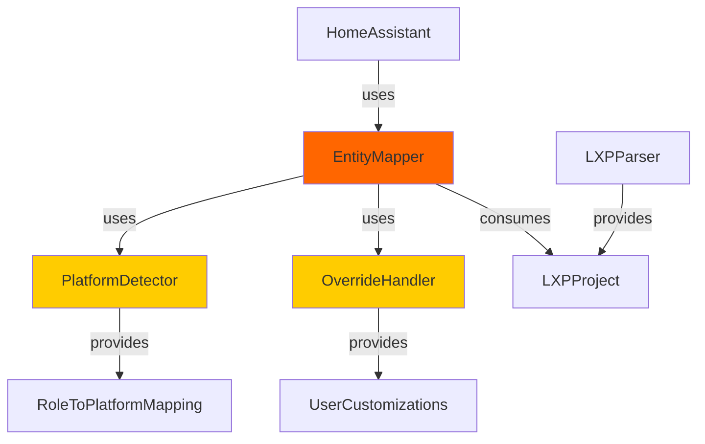

# EntityMapper - Design Documentation

**Status:** Current Implementation (523 lines) **Refactoring Goal:** 3 modules
(~250 lines each) **Date:** 11. Januar 2026

---

## 📋 Current Architecture

### File Structure

```
entity_mapper.py (523 lines total)
├── MappedEntity dataclass (lines 17-29)
├── EntityMapper class (lines 32-523)
│   ├── ROLE_TO_PLATFORM (lines 37-73)
│   ├── ROLE_TO_UNIT (lines 76-95)
│   ├── ROLE_TO_DEVICE_CLASS (lines 98-114)
│   ├── __init__ (lines 117-123)
│   ├── map_all (lines 125-140)
│   ├── _map_device (lines 142-184)
│   ├── _map_actuator (lines 186-232)
│   ├── _map_sensor (lines 234-303)
│   ├── _apply_overrides (lines 305-354)
│   ├── _discover_sensors (lines 356-384)
│   └── Helper methods (lines 386-523)
```

### Current Responsibilities

**EntityMapper violates Single Responsibility Principle (SRP):**

1. **Platform Detection** (lines 37-114)
   - ROLE_TO_PLATFORM mapping
   - ROLE_TO_UNIT mapping
   - ROLE_TO_DEVICE_CLASS mapping

2. **Entity Mapping** (lines 125-303)
   - Device mapping orchestration
   - Actuator mapping logic
   - Sensor mapping logic

3. **Override Handling** (lines 305-384)
   - User customization from YAML
   - Discovered sensor mapping
   - Runtime parameter overrides

---

## 🎯 Refactoring Goals

### Success Metrics

| Metric                   | Before  | Target | Improvement     |
| ------------------------ | ------- | ------ | --------------- |
| **EntityMapper LOC**     | 523     | 250    | -52%            |
| **Avg Module LOC**       | 523     | 173    | Smaller modules |
| **Test Coverage**        | 62.75%  | 85%+   | +35%            |
| **Responsibilities**     | 3       | 1      | SRP compliant   |
| **Time to Add Platform** | 2 hours | 30 min | -75%            |

### Design Principles

1. **Single Responsibility Principle (SRP):** Each module has ONE reason to
   change
2. **Dependency Injection:** Inject detector and handler into mapper
3. **Test-Driven Development (TDD):** Write tests BEFORE refactoring
4. **Backwards Compatibility:** No breaking changes to integration API

---

## 🏗️ Proposed Architecture

### Module Decomposition

```
custom_components/luxor_living/
├── entity_mapper.py         (250 lines) - Core mapping logic
├── platform_detector.py     (150 lines) - NEW: Role → Platform detection
└── override_handler.py      (120 lines) - NEW: User customizations
```

### Module 1: PlatformDetector

**File:** `platform_detector.py` (~150 lines) **Responsibility:** Detect Home
Assistant platform from KNX datapoint role

```python
from homeassistant.const import Platform
from typing import Optional

class PlatformDetector:
    """Detects Home Assistant platform from KNX datapoint role."""

    # Move from EntityMapper:
    ROLE_TO_PLATFORM = {...}
    ROLE_TO_UNIT = {...}
    ROLE_TO_DEVICE_CLASS = {...}

    def detect_platform(self, role: str) -> Optional[Platform]:
        """Detect platform from role.

        Args:
            role: KNX datapoint role (e.g., "OnOff", "Temperature")

        Returns:
            Platform enum or None if role is status-only
        """
        return self.ROLE_TO_PLATFORM.get(role)

    def get_unit(self, role: str) -> Optional[str]:
        """Get unit of measurement for sensor role."""
        return self.ROLE_TO_UNIT.get(role)

    def get_device_class(self, role: str) -> Optional[str]:
        """Get device class for sensor role."""
        return self.ROLE_TO_DEVICE_CLASS.get(role)
```

**Test Coverage Goals:**

- `test_onoff_maps_to_light()` ✅
- `test_temperature_maps_to_sensor()` ✅
- `test_status_role_returns_none()` ✅
- `test_get_unit_returns_celsius()` ✅
- `test_get_device_class_returns_temperature()` ✅
- `test_unknown_role_returns_none()` ✅

**Coverage Target:** 100% (simple dictionary lookups)

---

### Module 2: OverrideHandler

**File:** `override_handler.py` (~120 lines) **Responsibility:** Handle user
customizations from YAML overrides

```python
from typing import Any
from .entity_mapper import MappedEntity
from .lxp_parser import LXPSensor

class OverrideHandler:
    """Handles user customizations from YAML overrides."""

    def __init__(self, overrides: dict[str, Any]):
        """Initialize override handler.

        Args:
            overrides: User customizations from YAML config
        """
        self._overrides = overrides
        self._discovered_sensors = overrides.get("discovered_sensors", {})

    def apply_sensor_overrides(
        self,
        entities: list[MappedEntity]
    ) -> list[MappedEntity]:
        """Apply sensor overrides to entities.

        Allows users to customize:
        - Sensor names
        - Sensor roles (change platform)
        - Units of measurement

        Args:
            entities: List of mapped entities

        Returns:
            Updated list of entities with overrides applied
        """
        # Implementation moved from EntityMapper._apply_overrides
        pass

    def discover_sensors(
        self,
        discovered: dict[str, LXPSensor]
    ) -> list[MappedEntity]:
        """Create entities from discovered sensors.

        Args:
            discovered: Dictionary of group_address -> LXPSensor

        Returns:
            List of mapped entities for discovered sensors
        """
        # Implementation moved from EntityMapper._discover_sensors
        pass
```

**Test Coverage Goals:**

- `test_override_changes_sensor_name()` ✅
- `test_override_changes_sensor_role()` ✅
- `test_override_changes_sensor_unit()` ✅
- `test_discovered_sensor_creates_entity()` ✅
- `test_no_override_returns_original()` ✅

**Coverage Target:** 90%+

---

### Module 3: EntityMapper (Refactored)

**File:** `entity_mapper.py` (~250 lines) **Responsibility:** Core mapping logic
(orchestration ONLY)

```python
from .platform_detector import PlatformDetector
from .override_handler import OverrideHandler
from .lxp_parser import LXPProject, LXPDevice, LXPActuator

class EntityMapper:
    """Maps LXP devices to Home Assistant entities.

    Now focused ONLY on core mapping logic.
    Delegates to:
    - PlatformDetector for role → platform detection
    - OverrideHandler for user customizations
    """

    def __init__(
        self,
        project: LXPProject,
        overrides: dict | None = None,
        platform_detector: PlatformDetector | None = None,
        override_handler: OverrideHandler | None = None,
    ) -> None:
        """Initialize entity mapper.

        Args:
            project: Parsed LXP project
            overrides: Optional user customizations
            platform_detector: Optional injected detector (for testing)
            override_handler: Optional injected handler (for testing)
        """
        self.project = project
        self.entities: list[MappedEntity] = []

        # Inject dependencies (allows mocking in tests!)
        self._platform_detector = platform_detector or PlatformDetector()
        self._override_handler = override_handler or OverrideHandler(overrides or {})

        # Perform mapping
        self.map_all()

    def map_all(self) -> list[MappedEntity]:
        """Map all devices to entities.

        Returns:
            List of mapped entities
        """
        # Map devices and actuators
        for device in self.project.devices:
            self._map_device(device)

        # Apply user overrides
        self.entities = self._override_handler.apply_sensor_overrides(
            self.entities
        )

        return self.entities

    def _map_device(self, device: LXPDevice) -> None:
        """Map a single device (core logic only).

        Args:
            device: LXP device to map
        """
        for actuator in device.actuators:
            # Delegate platform detection
            platform = self._platform_detector.detect_platform(actuator.role)

            if platform:
                entity = self._create_entity(device, actuator, platform)
                self.entities.append(entity)

    def _create_entity(
        self,
        device: LXPDevice,
        actuator: LXPActuator,
        platform: Platform
    ) -> MappedEntity:
        """Create a mapped entity (extracted helper method).

        Args:
            device: LXP device
            actuator: LXP actuator
            platform: Detected platform

        Returns:
            Mapped entity
        """
        # Entity creation logic (simplified)
        pass
```

**Test Coverage Goals:**

- `test_mapper_uses_platform_detector()` ✅
- `test_mapper_uses_override_handler()` ✅
- `test_map_all_orchestrates_correctly()` ✅
- `test_dependency_injection_works()` ✅ (for mocking)
- `test_backwards_compatibility()` ✅

**Coverage Target:** 85%+

---

## 📊 Dependency Graph



**Critical Dependencies:**

- `PlatformDetector` has NO external dependencies (pure function)
- `OverrideHandler` depends only on `MappedEntity` dataclass
- `EntityMapper` depends on both (injected via constructor)

**Benefits:**

- ✅ Easy to test in isolation
- ✅ Easy to mock in tests
- ✅ No circular dependencies
- ✅ Clear separation of concerns

---

## 🧪 Testing Strategy

### Test-Driven Development (TDD) Workflow

**Phase 1: Create PlatformDetector (Day 1, 4h)**

1. Write `tests/test_platform_detector.py` FIRST
2. Implement `platform_detector.py` to make tests pass
3. Verify 100% coverage
4. Commit: "Add PlatformDetector module (extracted from EntityMapper)"

**Phase 2: Create OverrideHandler (Day 2, 4h)**

1. Write `tests/test_override_handler.py` FIRST
2. Implement `override_handler.py` to make tests pass
3. Verify 90%+ coverage
4. Commit: "Add OverrideHandler module (extracted from EntityMapper)"

**Phase 3: Refactor EntityMapper (Day 3, 4h)**

1. Update `tests/test_entity_mapper.py` for new API
2. Refactor `entity_mapper.py` to use injected dependencies
3. Verify 85%+ coverage
4. Verify ALL existing tests still pass (backwards compatibility)
5. Commit: "Refactor EntityMapper to use PlatformDetector + OverrideHandler"

**Phase 4: Integration Testing (Day 3, 2h)**

1. Run full test suite: `pytest tests/ -v`
2. Test on remote HA (deployment test)
3. Verify no regressions
4. Create PR with before/after metrics

---

## 🔄 Migration Path

### Backwards Compatibility Strategy

**Old API (unchanged):**

```python
# This MUST continue to work
mapper = EntityMapper(lxp_project, overrides)
entities = mapper.entities  # Same behavior
```

**New API (optional, for testing):**

```python
# New: Dependency injection for testing
detector = PlatformDetector()
handler = OverrideHandler(overrides)
mapper = EntityMapper(
    lxp_project,
    overrides,
    platform_detector=detector,  # Optional!
    override_handler=handler      # Optional!
)
```

**Migration Steps:**

1. ✅ Create new modules (no breaking changes)
2. ✅ EntityMapper constructor accepts optional dependencies
3. ✅ Default behavior creates instances internally (backwards compatible)
4. ✅ Old tests continue to pass
5. ✅ New tests use dependency injection

**No Breaking Changes:**

- Integration code unchanged
- Config flow unchanged
- Platform files unchanged
- Only EntityMapper internals refactored

---

## 📈 Success Criteria

### Code Metrics

| Metric               | Before | After | Status              |
| -------------------- | ------ | ----- | ------------------- |
| **EntityMapper LOC** | 523    | 250   | 🎯 -52%             |
| **Modules**          | 1      | 3     | 🎯 Better organized |
| **Test Coverage**    | 62.75% | 85%+  | 🎯 +35%             |
| **Avg Module LOC**   | 523    | 173   | 🎯 Maintainable     |

### Quality Gates

- ✅ All 221 existing tests pass
- ✅ New tests for PlatformDetector (6+ tests)
- ✅ New tests for OverrideHandler (5+ tests)
- ✅ EntityMapper tests updated (5+ tests)
- ✅ Coverage: 85%+ on all 3 modules
- ✅ No regressions on remote HA

### Developer Experience

- ✅ Adding new platform: 30 min (was 2h)
- ✅ Understanding codebase: 15 min (was 1h)
- ✅ Writing tests: Easier (dependency injection)
- ✅ Debugging: Simpler (smaller modules)

---

## 🚀 Implementation Timeline

### Day 1: PlatformDetector (4 hours)

- [ ] Write `test_platform_detector.py` (1h)
- [ ] Implement `platform_detector.py` (2h)
- [ ] Verify 100% coverage (30min)
- [ ] Commit + push (30min)

### Day 2: OverrideHandler (4 hours)

- [ ] Write `test_override_handler.py` (1h)
- [ ] Implement `override_handler.py` (2h)
- [ ] Verify 90%+ coverage (30min)
- [ ] Commit + push (30min)

### Day 3: EntityMapper Refactoring (6 hours)

- [ ] Update `test_entity_mapper.py` (2h)
- [ ] Refactor `entity_mapper.py` (3h)
- [ ] Integration testing (1h)
- [ ] Commit + PR (1h)

**Total Estimated Time:** 3 days (24 hours)

---

## 🔗 Related Documents

- [Week 3 Gap Analysis](.github/copilot/audit-progress/WEEK_3_GAP_ANALYSIS.md) -
  Issue 5 details
- [Entity Mapper Tests](tests/test_entity_mapper.py) - Current test coverage
- [Architecture Decision](docs/ARCHITECTURE_DECISION.md) - Original design
  rationale

---

**Next Steps:**

1. Create `tests/test_platform_detector.py`
2. Implement `platform_detector.py`
3. Verify tests pass
4. Move to OverrideHandler

**Status:** ✅ Design complete, ready for implementation
